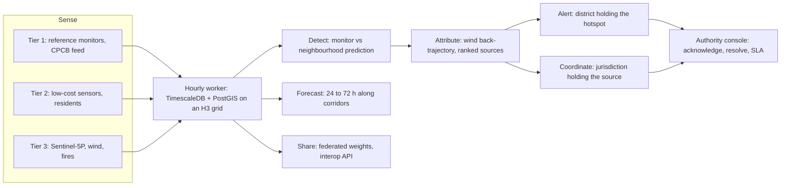
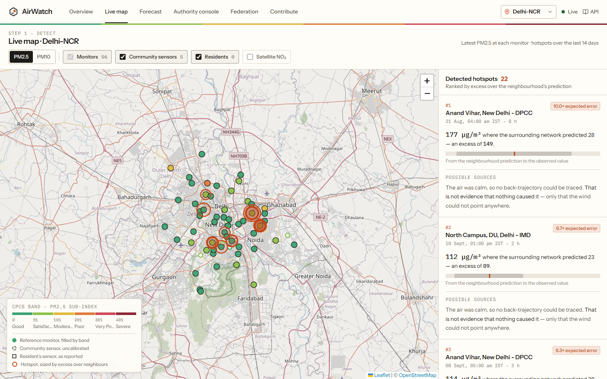
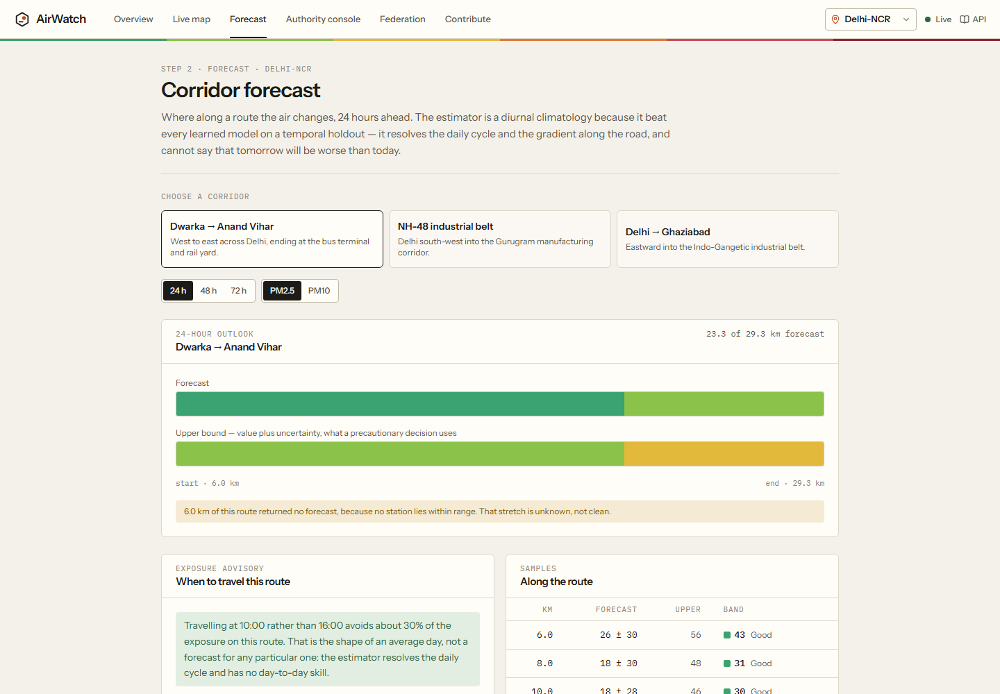
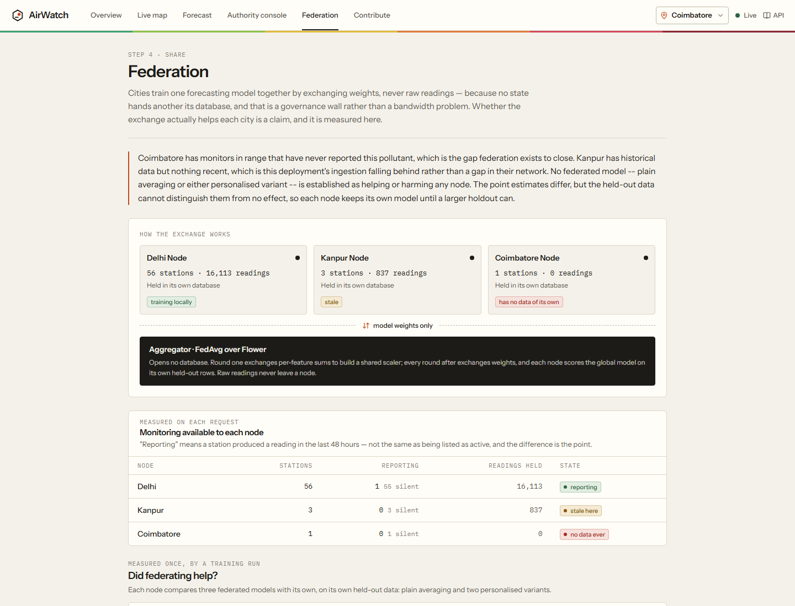

<div align="center">


# AirWatch

**Find the pollution the city average hides, trace it to a likely source, and get it in front of
the authority that can act on it.**

A federated, hyperlocal air-quality platform for Indian cities, built for the *Clean Air & Climate
Resilience* challenge. Piloted in Delhi-NCR, Kanpur and Coimbatore.

[**Live site**](https://airwatch-cbe.duckdns.org) ·
[API reference](https://airwatch-cbe.duckdns.org/docs) ·
[Validation](docs/VALIDATION.md) ·
[Design notes](docs/DESIGN.md) ·
[Deploy on AWS](docs/DEPLOY_AWS.md)

</div>


---

## In one minute

- **The problem.** India measures air quality with a few hundred expensive monitors and a 24-hour
  average. A three-hour plume from a kiln, a landfill or a bus depot never shows up in that number.
  Even when it is seen, nobody knows its source, and the source is often across a district or state
  line.
- **What AirWatch does.** It combines the official network, community and household sensors,
  residents' photographs, Sentinel-5P satellite columns, hourly wind and NASA fire detections. From
  these it:
  - flags any monitor reading far above what its neighbours predict;
  - traces that excess back along the wind to ranked candidate sources;
  - forecasts 24–72 hours ahead along economic corridors;
  - alerts the district that holds the hotspot, and asks the jurisdiction that holds the source to
    act too;
  - lets cities train a model together by sharing weights, never raw data;
  - explains every screen aloud in English, Hindi or Tamil, with the words on screen as it speaks.
- **What makes it credible.** Every figure is validated against held-out real monitors and published
  with its uncertainty, including the results where a learned model lost to a simple baseline. The
  system says "we cannot see here" rather than drawing unmonitored ground as clean.
- **Is it real?** Yes: it is deployed, updates hourly, and has already produced a cross-state
  coordination request from live data (see [§3.6](#36-coordinating-across-cities-and-states)).
  Tests: 907 backend, 120 frontend, all run in CI together with a replay of a recorded pollution
  episode.

## Contents

1. [The problem, as a Coimbatore resident sees it](#1-the-problem-as-a-coimbatore-resident-sees-it)
2. [The idea: three tiers of evidence, one chain of action](#2-the-idea-three-tiers-of-evidence-one-chain-of-action)
3. [How each part of the challenge is answered](#3-how-each-part-of-the-challenge-is-answered)
4. [The product, screen by screen](#4-the-product-screen-by-screen)
5. [What the evidence says](#5-what-the-evidence-says)
6. [Is it feasible?](#6-is-it-feasible)
7. [How it is built](#7-how-it-is-built)
8. [Run it, test it, deploy it](#8-run-it-test-it-deploy-it)
9. [API](#9-api)
10. [Known limitations](#10-known-limitations)

---

## 1. The problem, as a Coimbatore resident sees it

Coimbatore is home to about 2.5 million people. OpenAQ lists a single reference monitor in range,
SIDCO Kurichi. Its particulate readings reach OpenAQ days late, and its PM2.5 sensor stopped
reporting weeks ago. The site still counts as "active", because its other sensors still report. On
paper the city is monitored; in practice, nobody knows what is in the air on any given street.

Delhi has the opposite problem and the same blind spot. With more than 50 monitors it is one of the
densest networks in the country, yet in our leave-one-out test neighbouring stations explained
**less than a quarter of the variance** at a location they did not cover (R² 0.25). Four structural
causes sit underneath:

| Root cause | What it means on the ground |
| --- | --- |
| **Accurate instruments cannot be dense.** A CPCB reference station (CAAQMS) costs about ₹1–1.5 crore; India has roughly 400–550 of them. | One monitor stands in for tens of km², while PM2.5 can vary 3–5× within a kilometre. |
| **The AQI looks backwards.** It is a 24-hour rolling average. | A three-hour toxic plume is diluted into a daily number published after people have breathed it. |
| **Data follows administrative lines; pollution does not.** CPCB, some 35 state boards, municipalities and private networks each hold a fragment. | Smoke from one state is another state's emergency, and no state hands its raw data to another. |
| **Without attribution there is no enforcement.** | Responses are blunt and collective, such as halting all construction under GRAP, instead of "this kiln, this depot". |

The cost is concentrated on outdoor workers, children in schools on arterial roads, settlements
beside industrial corridors and landfills, and people with respiratory or cardiac disease. PM2.5
exposure is associated with about 1.7 million deaths in India in 2022, and air pollution costs
roughly 9.5% of GDP.

## 2. The idea: three tiers of evidence, one chain of action

AirWatch does not try to replace the reference network. It uses that network as ground truth, adds
denser but less accurate sources around it, and uses satellites and weather to cover the gaps. It
keeps every tier separate and labelled, so a ₹15,000 sensor is never mistaken for a ₹1-crore monitor.

| Tier | Sources in AirWatch | Property | Used for |
| --- | --- | --- | --- |
| **1 · Ground truth** | CPCB/state reference monitors via OpenAQ; CPCB's live AQI feed via data.gov.in | Accurate, sparse | Detection, validation, the reference every other tier is compared against |
| **2 · Dense, biased** | Community low-cost networks (AirGradient); residents' photographs; residents' household sensor readings | Everywhere, systematically wrong | Coverage, shown uncalibrated; builds the evidence to calibrate against tier 1 |
| **3 · Complete, coarse** | Sentinel-5P NO₂, SO₂, CO and aerosol index via Google Earth Engine; Open-Meteo wind; NASA FIRMS fires | Full coverage, low resolution | The regional picture between monitors, wind for back-trajectories, fires as candidate sources |



Every stage has one screen, one set of API endpoints, and one honest statement of what it cannot
establish.

## 3. How each part of the challenge is answered

| The challenge asks for | What AirWatch does | Where to see it |
| --- | --- | --- |
| Citizen-sourced **photos** | Measures atmospheric haze from a photo; refuses dark, blurred or over-exposed images; derives no PM2.5 until 30 photos taken near monitors calibrate it | Contribute → *Photograph*; `POST /v1/citizen/reports` |
| Citizens **complaining**, and being able to follow up | Every submission can carry a concern and a description, and produces a PDF complaint report naming the responsible authorities | Contribute → *Your reports*; `GET /v1/citizen/complaints` |
| Citizen-sourced **local sensor readings** | Accepts PM2.5/PM10 from household sensors, stores them as reported, pairs each with the nearest monitor, publishes the tier's measured bias | Contribute → *Sensor reading*; map squares; `POST /v1/citizen/sensor-readings` |
| **Satellite imagery** | Daily Sentinel-5P columns per ~36 km² cell, for NO₂, SO₂, CO and aerosol index | Overview tier 3; map layer; `GET /v1/satellite` |
| **Meteorological data** | Hourly wind for every pilot city, steering each back-trajectory from the nearest weather cell | Hotspot sources on the map |
| **Detect hidden hotspots** | A monitor far above what its neighbours predict, for hours; ranked by excess, not concentration | Live map; `GET /v1/hotspots` |
| **Forecast spikes across economic corridors** | 24/48/72 h outlook along named corridors, with uncertainty, unforecast stretches, and the best departure hour | Forecast; `GET /v1/forecast/corridor`, `/v1/exposure/advisory` |
| **Alert relevant authorities** | Routed by OpenStreetMap district and state boundaries; one alert per episode; SLA deadlines; webhook delivery; resolution note required | Authority console; `GET /v1/alerts` |
| **Coordinate resources** across cities and states | When a hotspot's likely source lies in another jurisdiction, that jurisdiction is asked to act | Console → *Across a boundary* |
| **Interoperability, sharing predictive models** | Flower federated learning exchanges weights only; OGC SensorThings-shaped GeoJSON exchange API; model cards | Federation; `GET /v1/interop/*` |

### 3.1 Citizen-sourced data: photographs and household sensors


Residents are the only dense tier a city like Coimbatore can get quickly, and also the tier most
likely to be believed beyond what it can support. Both citizen inputs are therefore built to *fail
towards silence*.

**Photographs.** A photo cannot measure PM2.5. What it can measure is how much contrast the air has
removed, recovered with the dark-channel prior as a **haze index** from 0 to 1.

- Dark, blurred and over-exposed frames are refused with a reason, because each makes clean air
  look dirty.
- EXIF data is checked and acted on only when it *contradicts* the submission.
- No concentration is published until 30 photos taken within 3 km of a reporting monitor have
  calibrated the relation. Until then the response says why, rather than giving a rough number.

**Household sensor readings** (AirGradient, PurpleAir, Atmotube and similar). A resident posts what
their sensor shows, with its model name and time.

- Values that no ambient air can reach are refused.
- Accepted readings are stored **exactly as reported** and paired with the nearest monitor reading
  within 3 km and 90 minutes.
- The tier publishes its median sensor-to-monitor ratio, and marks it established only after 30
  pairs. Readings stay out of detection, fusion and forecasting.
- On the map they are squares, never circles, so they cannot be mistaken for a monitor.

**A complaint report for every submission.** Either kind of submission can say what the resident
saw: open burning, industrial smoke, construction dust and so on, plus a description in any
language. Each one gets a reference such as `AW-S-000042` and a **downloadable PDF** containing:
- what was reported and what AirWatch measured;
- how it compared with the nearest monitor;
- the district administration and state board responsible for that spot;
- an honest account of what happens next.

The PDF is meant to be attached to an official grievance. Only the browser that made a submission
can list it or download its report, and Tamil or Hindi descriptions print correctly.

*Why this shape:* [docs/DESIGN.md](docs/DESIGN.md#household-sensor-readings-and-why-none-is-corrected).

<br clear="right" />

### 3.2 Satellite imagery and meteorology

**Sentinel-5P.**
- Daily TROPOMI means of NO₂, SO₂, CO and absorbing aerosol index are pulled through Google Earth
  Engine for each coarse H3 cell over each city.
- Units are kept as delivered, and cells with too few valid pixels are omitted rather than filled.
- In Coimbatore this is the only view of the air between and beyond its single monitor. The overview
  shows a 14-day trend and the map can overlay the cells.
- It is labelled as a column over ~36 km², never as street-level concentration.

**Weather.**
- Open-Meteo wind is ingested hourly for every pilot city.
- A back-trajectory walks the air parcel upwind in 15-minute steps through the *nearest* weather cell
  within 40 km. Keying wind by hour alone had let one city's trajectory run through another city's
  wind; that bug was found and fixed.
- NASA FIRMS VIIRS fire detections enter attribution as candidate sources, weighted by radiative
  power and discarded if they postdate the hotspot.

### 3.3 Detecting hidden hotspots

A threshold alarm fires on a bad day across a whole city and stays silent on a bus depot in a clean
one. AirWatch instead estimates what each monitor *should* read from its neighbours, and flags a
location when three conditions hold: the excess is large relative to the expected error, it
persists, and it is confirmed against neighbours. Forty µg/m³ in clean Coimbatore can be an event;
the same reading in Delhi in November is noise.



**The acceptance test.**
- A committed fixture holds 1,232 real readings from 59 Delhi stations.
- The replay runs the real detector over it and must report Anand Vihar: *381 µg/m³ where the network
  predicted 40, z = 20.4*.
- The top candidate source must be *Anand Vihar ISBT and rail terminal (60% plausible)*.
- The replay runs in CI and fails the build if detection regresses.

Where a city has too few monitors to compare, the map says so: *"no hotspot here means no comparison
was possible, not that the air holds no surprises."*

### 3.4 Forecasting spikes across economic corridors



**What is shown.** Choose a corridor, such as Dwarka → Anand Vihar, NH-48, Ukkadam → SIDCO Kurichi
or Avinashi Road. AirWatch then shows:
- the 24, 48 or 72-hour outlook along it, coloured by CPCB sub-index;
- a precautionary upper bound (value plus uncertainty);
- stretches no monitor supports, hatched as unknown.

**Exposure advisory.** This ranks departure hours by exposure along the route. On Dwarka–Anand Vihar,
leaving at 20:00 instead of 16:00 avoids about 25% of the exposure. When the day's variation is
smaller than the forecast's own error, no hour is named.

**The honest part.** On a temporal holdout, a diurnal climatology beat every learned model at every
horizon: 15.8 µg/m³ MAE at 24 h, against 17.4 for the best LightGBM model and 21.7 for persistence.
So climatology is what ships. It resolves the daily cycle and the gradient along a road; it cannot
say tomorrow will be worse than today, and the screen says so.

### 3.5 Alerting authorities for rapid intervention

- **Routing is spatial.**
  - Each hotspot goes to the lowest-tier authority whose boundary contains it: district
    administration first, then the state pollution body.
  - Boundaries for 23 authorities come from OpenStreetMap.
  - A hotspot inside no boundary is reported as *unrouted*, never silently dropped.
- **One alert per episode.** An eight-hour fire is one event.
- **Silence is recorded.**
  - Alerts carry acknowledgement and resolution deadlines, and closing one requires a note of what
    was done.
  - Recording and delivery are separate facts: a failed webhook keeps the alert queued with the
    reason.
- **Operators are authenticated.** Anyone can read the trail. Acknowledging, resolving and running
  detection require an operator key, compared in constant time.

### 3.6 Coordinating across cities and states

Routing an alert to the district where the hotspot sits sends it to the one body that often cannot
touch the cause. So dispatch traces each hotspot upwind. When the likeliest source (at least 50%
plausible) lies inside a **different** jurisdiction, that jurisdiction receives a **coordination
request** alongside the local alert.


**The first one came from live data**, with nothing configured by hand:
- The UP monitor at Prashant Garden, Khora read **74 µg/m³ where its neighbours predicted 20**.
- The local alert went to the Gautam Buddha Nagar administration in Uttar Pradesh.
- The back-trajectory ranked the **Ghazipur landfill** first, at 69% plausible, and the landfill is
  in East Delhi.
- The East Delhi district administration was therefore asked to act for its neighbour, across a
  state line.

The request states its confidence and says plainly that it is *a ranked candidate, not an
established cause*. The webhook event is `airwatch.coordination_request`, with the source to
inspect.

### 3.7 Sharing predictive models: federation and interoperability



**Federation.**
- Each city is a node that trains the forecasting model on its own data. A Flower server aggregates
  weights (FedAvg) and never opens a database.
- The first round exchanges only per-feature sums, to build a shared scaler.
- The same protocol runs in-process for validation and across processes over gRPC; with pinned data
  the two give identical results.

**Interoperability.**
- `/v1/interop/*` publishes observations and detected episodes as GeoJSON with OGC SensorThings
  property names, an explicit CRS, licence and measurement tier.
- It also publishes model cards: what each estimator scored, and what it lost to.

**Does sharing help?** Measured with station-level bootstrap intervals, and the honest answer is
*not yet established*. Delhi's differences are real but a few hundredths of a µg/m³; Kanpur's 23
held-out rows cannot tell any variant from no effect. Each node keeps its own model and no weights
are pushed on a data-poor city without evidence. What would settle it is more Kanpur history, not a
different model. Full tables are in [docs/VALIDATION.md](docs/VALIDATION.md).

## 4. The product, screen by screen

The interface follows the chain of work: **Overview → Live map → Forecast → Authority console →
Federation → Contribute**.
- **On a desktop:** the screens are tabs in a masthead that also holds the city and a live-data
  indicator.
- **On a phone:** they move to a bottom bar within thumb reach, and the map's hotspot list becomes a
  sheet that opens from the bottom.

| Overview | Live map | Contribute |
| :---: | :---: | :---: |
|  |  |  |

The overview reads as a numbered argument rather than a wall of widgets:
1. **Right now:** CPCB's official index beside the latest reading at each monitor.
2. **What the network can see here:** each tier's count for *this* city, with "thin here" and
   "nothing yet" where that is the truth.
3. **What is unexpected:** hotspots, or why none can be detected.
4. **Who has been told:** open alerts, overdue ones, requests across a boundary, and alerts never
   delivered.
5. **How it works.**

A shared link such as `/?city=delhi&pollutant=pm25#/map` opens on that city and pollutant.

**A spoken guide on every screen.** The resident most exposed to bad air is the least likely to read
an English dashboard. So **Listen**, in the masthead of every screen, explains what that screen shows
and how to use it, spoken in **English, हिन्दी or தமிழ்** by an Indian-language voice (Sarvam AI,
Bulbul v3):
- A first visit offers the guide once, each language written in its own script, so one tap both
  picks the language and starts it. The choice is remembered, and a phone set to Tamil opens in Tamil.
- The transcript is on screen and follows the voice paragraph by paragraph. Tapping a paragraph plays
  from there, and the guide works in full with the sound off.
- The panel sits beside the page, not over it, because it describes what is behind it.
- Speech is generated once per paragraph at deploy time and stored, so listeners never wait and the
  guide keeps talking even if the speech service is down. Without a key, the text guide still works.

**Design choices that carry meaning:**
- The six CPCB band colours are the only saturated colour, so a "Poor" reading is never competing
  with decoration.
- Figures are set in a monospace so columns line up.
- Monitors, community sensors, residents' sensors and hotspots use four shapes that cannot be
  confused.
- A failed request is never drawn as an empty map. Loading, empty, failed and successful states each
  have their own colour and glyph.

## 5. What the evidence says

All figures were measured on data pinned before 12 September 2026, on **reference monitors only**,
with 95% intervals from a bootstrap that resamples whole stations. A method is called better or
worse only if its interval excludes zero *and* the difference clears 2%.

| Question | Result | Verdict |
| --- | --- | --- |
| How well can an unmonitored location be reconstructed? (leave one station out, 33 Delhi stations, 7,001 station-hours) | Inverse-distance weighting: MAE **11.75 µg/m³**, R² **0.246**. LightGBM: 12.76 absolute and 13.00 residual. | No learned model beats interpolation, so **IDW ships**. Low R² is the problem itself, measured. |
| Is the uncertainty honest? | Error rises with disagreement between nearby monitors, from 10.5 to 24.8 µg/m³ | Every fused cell publishes an uncertainty fitted to this; unsupported cells return nothing |
| Which forecast works at 24 / 48 / 72 h? | Climatology **15.8 / 16.4 / 16.2** · LightGBM residual 17.4 / 19.6 / 19.0 · persistence 21.7 / 23.0 / 22.2 | **Climatology ships**; every learned model is significantly worse |
| Does federation help the sparse node? | Kanpur: every variant inconclusive (23 test rows). Delhi: differences of hundredths of a µg/m³. | **Not established either way**; each node keeps its own model |
| Does detection find a known episode? | Anand Vihar, 381 vs 40 predicted, z = 20.4, source ranked first | **PASS**, and enforced in CI |

These are published *because* two learned models lost. An earlier claim that federation "harmed"
Kanpur rested on a point estimate. It was corrected in the README, on the dashboard and in the model
card, and the evidence rule that caught it (`core/evidence.py`) now decides every published verdict.
Details: [docs/VALIDATION.md](docs/VALIDATION.md).

## 6. Is it feasible?

**Cost to run a city node.**

| Item | Cost |
| --- | --- |
| Server: one AWS `t3.small` running API, worker, database and HTTPS | about **US$20 a month**; also runs on any Ubuntu host, including Oracle Cloud's free tier |
| Data: OpenAQ, data.gov.in, NASA FIRMS, Open-Meteo, Google Earth Engine (non-commercial), OpenStreetMap | **free**, with registration keys |
| Densifying a neighbourhood with household sensors | a few thousand to ~₹20,000 per sensor, against ₹1–1.5 crore per reference station |

**Adoption path for a new city or state:**
1. Deploy the stack with two scripts: [docs/DEPLOY_AWS.md](docs/DEPLOY_AWS.md).
2. Load its district and state boundaries with `tools/fetch_osm_jurisdictions.py`.
3. Confirm with those bodies which office receives each tier of alert, and set its webhook.
4. Invite residents and community sensor owners to contribute; the bias of their tier becomes
   measurable as readings accumulate beside monitors.
5. Join the federation as a node. Raw data stays on the state's own server; only weights travel.

**Why it scales across governance lines.** Nothing in the design needs a national data lake:
- A node shares weights, and GeoJSON observations it can audit before sending.
- Routing and coordination come from boundaries and wind, not from any per-station setup.
- Each node degrades honestly: a city with one monitor still gets the official feed, the satellite
  picture, citizen tiers and forecasts where coverage allows, and is told exactly what it lacks.

**Already running.** The live site has served from a single server since 13 September 2026:
- ingests all three cities hourly and Sentinel-5P daily;
- has routed 23 alerts, including one coordination request;
- restarts cleanly with `deploy.sh`, and backs up nightly.

## 7. How it is built

| Layer | Technology |
| --- | --- |
| API | Python 3.12, FastAPI, Pydantic v2, SQLAlchemy 2, Alembic |
| Data | PostgreSQL 16 + PostGIS + TimescaleDB; H3 hexagons (resolution 8, ~0.46 km²) as the shared spatial key |
| Analysis | NumPy, LightGBM for the validated candidates, Flower for federation, earthengine-api |
| Web | React 18, TypeScript (strict), Vite, Tailwind CSS 4, Leaflet with OpenStreetMap tiles; types generated from the OpenAPI spec |
| Operations | Docker Compose, Caddy (automatic HTTPS, strict CSP), an hourly worker, nightly `pg_dump` backups |

**Engineering rules, enforced rather than aspired to** (see [CLAUDE.md](CLAUDE.md)):
- **Layering.** Code depends in one direction: routes → services → repositories. `ml/` holds pure
  analysis, `core/` holds shared calculations, and services never import each other.
- **No magic numbers.** Every threshold lives in `core/constants.py` with its source or reasoning.
- **Typed errors.** Every error is typed and returned in one JSON envelope with a correlation ID.
  Missing credentials produce an explicit error, never a placeholder reading.
- **Strict types.** `mypy --strict` for Python and `strict` TypeScript; ruff and ESLint.
- **Tests mirror the code.** They follow the source tree one-to-one, never call the network, and run
  against real PostGIS where SQL matters.
- **CI on every push:**
  - lint, format and type checks;
  - migrations applied, rolled back and re-applied, then `alembic check`;
  - 907 backend and 120 frontend tests;
  - the Anand Vihar replay;
  - both Docker images built and the production compose file validated.

```
backend/app/
  core/          constants, AQI math, geo, H3, alerting and evidence rules
  external/      OpenAQ, CPCB, FIRMS, Open-Meteo, Sentinel-5P, Sarvam AI speech, webhook clients
  repositories/  the only place SQL and PostGIS appear
  ml/            detection, attribution, forecasting, fusion, vision, co-location
  services/      one per pillar: ingestion, analysis, alerts, citizen, satellite, federation, interop, voice guide
  documents/     the PDF complaint report's layout
  guides/        the spoken guide's scripts, one TOML file per language
  routes/        thin HTTP layer
federated/       Flower client, server and protocol
ml/              validation scripts that produced every published figure
frontend/src/    features/ per screen, components/ui, hooks, lib (the only fetch and coordinate code)
infra/           compose files, Caddy, deploy and backup scripts, seeds and recorded fixtures
```

## 8. Run it, test it, deploy it

**Prerequisites:** Docker, Node 20+, Python 3.12. Free keys for OpenAQ, data.gov.in and NASA FIRMS
go in `.env` (copy `.env.example`). Earth Engine is optional.

```bash
npm install
npm run db:up         # PostgreSQL + PostGIS + TimescaleDB
npm run db:migrate    # apply migrations
npm run seed          # source registry and 23 authority boundaries
npm run worker:once   # one full cycle: every pilot city's readings, weather, fires, CPCB feed
npm run backfill -- --city delhi --pollutant pm25   # hourly history for detection and forecasts
npm run dev           # API on :8000, web on :5173
```

Keep it current with `npm run worker`: one cycle an hour covering ingestion, the official feed,
detection and routing, and delivery, plus the satellite fetch once a day.

**Verify the claims yourself:**

```bash
npm run check                 # lint, formatting, types and every test
npm run demo:replay           # the recorded Anand Vihar episode must print PASS
npm run ml:validate-loso      # leave-one-station-out reconstruction
npm run ml:validate-forecast  # temporal-holdout forecast comparison
npm run fl:validate           # does federation help the sparse node?
```

The federation also runs across real processes over Flower's gRPC transport:

```bash
npm run fl:server -- --nodes 2
npm run fl:node -- --city delhi --pinned
npm run fl:node -- --city kanpur --pinned
```

**Deploy:** a single Ubuntu server runs everything behind Caddy with automatic HTTPS. The
step-by-step AWS guide is [docs/DEPLOY_AWS.md](docs/DEPLOY_AWS.md); on any other host run
`infra/deploy/bootstrap.sh`, fill in `.env` from `.env.production.example`, then
`infra/deploy/deploy.sh --first-load`.

## 9. API

Interactive reference: [`/docs`](https://airwatch-cbe.duckdns.org/docs). Every estimated quantity
carries its uncertainty or confidence, and every error returns the same envelope.

| Endpoint | What it answers |
| --- | --- |
| `GET /v1/health` | Is the API up, and which upstreams are configured |
| `GET /v1/cities` | The pilot cities, their centres and default pollutants |
| `GET /v1/stations` | Latest reading at every reference monitor, worst first |
| `GET /v1/sensors` | Community low-cost sensors, uncalibrated |
| `GET /v1/official-aqi` | CPCB's latest published index per station |
| `GET /v1/satellite` | A Sentinel-5P product over a city: daily series and latest cells |
| `GET /v1/hotspots` | Locations dirtier than their neighbourhood predicts, with ranked sources |
| `GET /v1/forecast/corridor` | Outlook along a route, with uncertainty and sub-index per point |
| `GET /v1/exposure/advisory` | When to travel a route, by the exposure each departure costs |
| `GET /v1/alerts` · `GET /v1/alerts/sla-breaches` | The alert trail, including coordination requests, and what is overdue |
| `POST /v1/alerts/dispatch` · `/deliver` · `/{id}/acknowledge` · `/{id}/resolve` | Operator actions (bearer key) |
| `POST` · `GET /v1/citizen/reports` · `GET /v1/citizen/calibration` | Photographs and the state of their calibration |
| `POST` · `GET /v1/citizen/sensor-readings` | Household sensor readings and the tier's measured bias |
| `GET /v1/citizen/complaints` · `/{reference}/pdf` | This browser's own submissions, and the PDF complaint report for each (`X-Device-ID` header) |
| `GET /v1/federation/status` | Node coverage and whether federating helped |
| `GET /v1/guide/{screen}?language=hi` · `/sections/{index}/audio` | A screen's spoken guide: the transcript, and each paragraph as MP3 (English, Hindi, Tamil) |
| `GET /v1/interop/capabilities` · `/observations` · `/hotspots` · `/models` | The exchange a partner city consumes |

## 10. Known limitations

These are deferred deliberately and recorded here rather than as TODOs in the code.

**Coverage and data**
- **Coimbatore has one reference monitor in range, and its PM2.5 sensor is down.**
  - The dashboard opens on Coimbatore and PM10.
  - Detection and corridor forecasts need several monitors, and there they say they cannot run.
  - The official feed, satellite and citizen tiers still work.
- **Station-level activity is not pollutant-level activity.** A site whose PM2.5 sensor is dead still
  reports as active if any other sensor is live.
- **Upstream CO units are not trustworthy.**
  - Delhi stations declare CO in ppb while reporting values that are plausible only as ppm.
  - The plausibility guard flags them and they are excluded; they are never "corrected", because
    guessing what an instrument meant would be inventing a number.
- **CPCB's live feed gives sub-indices, not concentrations**, so it is shown as the official index
  and never fed into analysis.
- **Sentinel-5P is a regional covariate, not a hotspot detector.** At ~36 km² it cannot locate a
  single kiln, and cloudy days are omitted.
- **FIRMS misses fires between satellite overpasses**, and most stubble burning has shifted to
  16:00–18:00 to avoid them.

**The dense tier**
- **Low-cost and household sensors are uncalibrated and kept out of analysis.** Their bias is being
  measured against monitors as pairs accumulate; no correction is applied yet.
- **Photographs yield no concentration until 30 co-located pairs exist.** That is intended behaviour,
  not a missing feature.
- **EXIF can corroborate a photo but not authenticate it.** Metadata is editable; this raises the
  cost of spoofing without closing it.

**Models**
- **The fused surface is inverse-distance weighting and the forecast is a climatology.** Both are
  empirical decisions: learned models were measured against them and lost.
- **The forecast has no day-to-day skill.** It resolves the daily cycle, not whether tomorrow is
  worse than today.
- **Back-trajectory uses a single-layer wind field**, not full HYSPLIT dispersion. Candidates are
  ranked, never asserted.
- **No federated model is established as helping or harming either node**; Kanpur's holdout is too
  small to tell.
- **No model weights are published for exchange.** Model cards publish performance; the envelope
  supports weights, but nothing has earned a recommendation.

**Operations and governance**
- **Boundaries are real; who answers inside them is an assumption.** The district-first, state-second
  assignment is an explicit table that a deployment must confirm with those bodies. Retired
  authorities keep their history.
- **Coordination requests depend on the source registry and wind history.** A source not in the
  registry, or an hour with no wind record, produces no request.
- **The voice guide is scripted, not conversational.** It explains the screens; it does not read out
  today's figures or answer questions. The Hindi and Tamil scripts were written by the team and should
  be reviewed by native speakers working in air quality before a public launch; they live in
  `backend/app/guides/scripts` so that review needs no code.
- **Delivery is a webhook only.** There is no email or SMS gateway; without an endpoint, alerts are
  recorded and shown as not delivered.
- **Operators share one key; there are no named accounts.** The trail records what was done, not
  which operator did it. Rate limiting is per process.
- **Federation nodes in the pilot share one database and one machine.** A deployment across state
  boundaries needs TLS and node authentication. Nodes use Flower's `start_server`/`start_client`,
  which are superseded by SuperLink/SuperNode.

## Credits and licence

Data: OpenAQ; CPCB via data.gov.in; NASA FIRMS; Open-Meteo; Copernicus Sentinel-5P via Google Earth
Engine; boundaries and map tiles © OpenStreetMap contributors (ODbL).

MIT licence.
