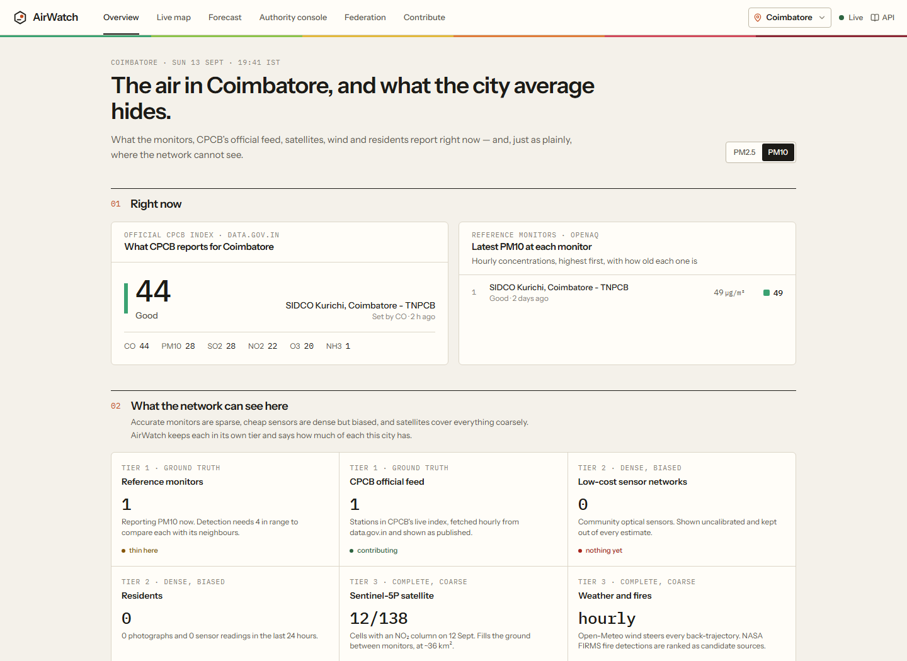
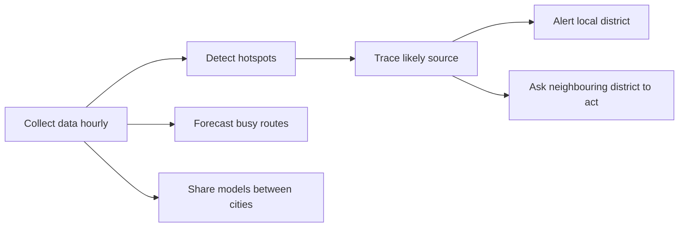
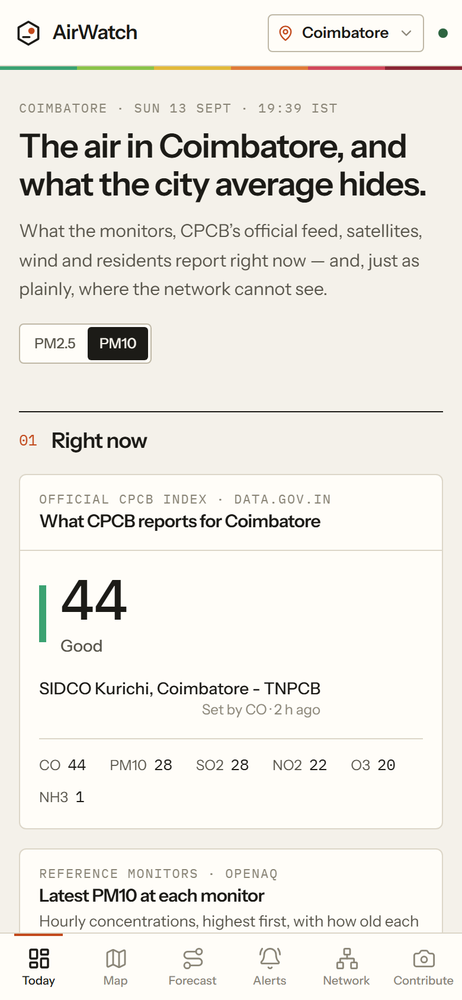
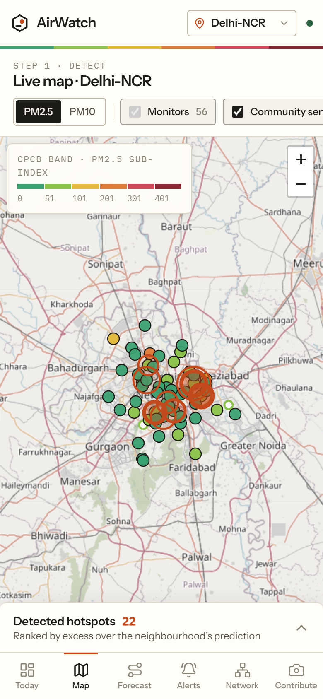
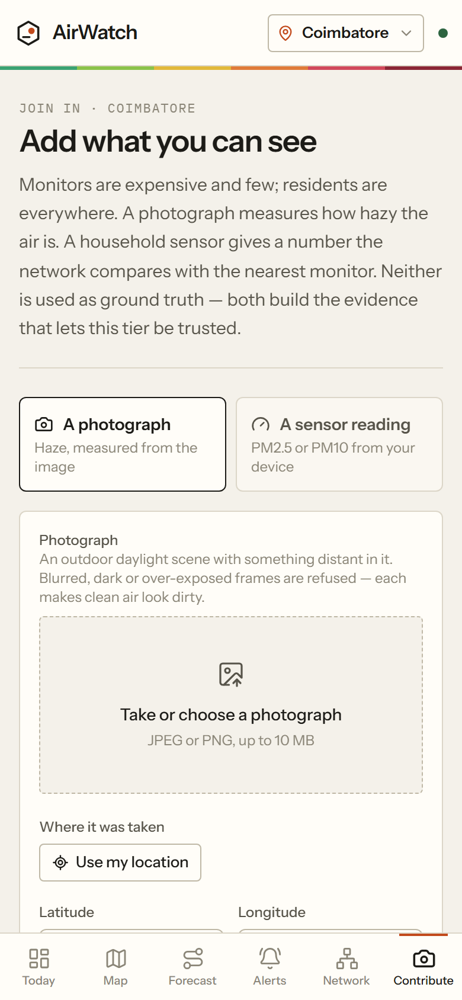
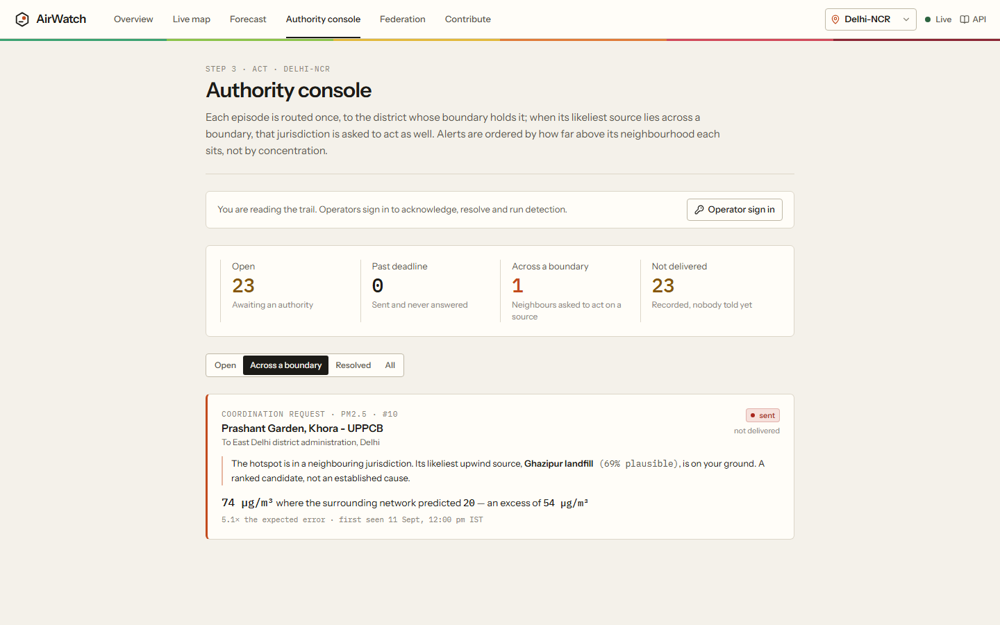

<div align="center">


# AirWatch

**Find pollution the city average hides, trace it to a likely source, and alert the authority that
can act.**

Built for the *Clean Air & Climate Resilience* challenge · Live in Delhi-NCR, Kanpur and Coimbatore

[**Live site**](https://airwatch-cbe.duckdns.org) ·
[API docs](https://airwatch-cbe.duckdns.org/docs) ·
[Validation](docs/VALIDATION.md) ·
[Design notes](docs/DESIGN.md) ·
[Deploy guide](docs/DEPLOY_AWS.md)

</div>



## In short

| | |
| --- | --- |
| **Problem** | India has only a few hundred official air monitors and reports a 24-hour city average. A three-hour plume from a landfill or bus depot never shows up, nobody knows its source, and the source is often in another district or state. |
| **Solution** | AirWatch combines government monitors, low-cost and home sensors, residents' photos, satellite data, wind and fire detections. It spots unusual pollution, names likely sources, forecasts busy routes, and alerts the responsible authority. |
| **Proof** | Deployed and updating hourly. It has already sent a real cross-state request (Uttar Pradesh → East Delhi). 907 backend and 120 frontend tests run in CI. |
| **Honesty** | Every number shows its uncertainty. Where there is no data, it says "unknown", never "clean". |

## Key terms

| Term | Meaning |
| --- | --- |
| **CPCB** | Central Pollution Control Board, India's national body that runs the official monitors and the Air Quality Index. State boards (DPCC for Delhi, UPPCB, TNPCB) run monitors too. |
| **PM2.5** | Fine particles up to 2.5 micrometres (about 30 times thinner than a hair), mostly from burning and vehicles. The most harmful pollutant: it reaches deep into the lungs. India's 24-hour limit is 60 µg/m³. |
| **PM10** | Coarser particles up to 10 micrometres, mostly road and construction dust. India's 24-hour limit is 100 µg/m³. |
| **µg/m³** | Micrograms of pollutant in one cubic metre of air. |
| **AQI** | Air Quality Index, 0–500. Good (0–50) · Satisfactory · Moderate · Poor · Very poor · Severe (401–500). |
| **Hotspot** | A monitor reading far above what its neighbouring monitors predict, for several hours. |
| **Back-trajectory** | Tracing the wind backwards from a hotspot to find where the polluted air came from. |
| **Federated learning** | Cities train one shared model by exchanging what their models learned, never their raw data. |

## How it works

AirWatch uses three kinds of data and keeps them separate, so a ₹15,000 sensor is never mistaken for
a ₹1-crore government monitor.

| Tier | Sources | Strength | Weakness |
| --- | --- | --- | --- |
| **1 · Ground truth** | CPCB and state monitors (via OpenAQ), CPCB's live AQI (via data.gov.in) | Accurate | Few |
| **2 · Dense** | Community sensors, residents' photos and home sensor readings | Everywhere | Less accurate |
| **3 · Complete** | Sentinel-5P satellite, Open-Meteo wind, NASA FIRMS fires | Covers everything | Coarse |



## What the challenge asked for, and where it is

| Challenge asks for | AirWatch | Screen |
| --- | --- | --- |
| Citizen photos | Measures haze from a photo; rejects dark, blurry or over-bright images | Contribute |
| Citizen sensor readings | Accepts PM2.5/PM10 from home sensors and compares each with the nearest monitor | Contribute |
| Citizen complaints | Every submission gets a reference number and a PDF report naming the responsible authorities | Contribute → Your reports |
| Satellite and weather data | Daily Sentinel-5P gases; hourly wind for tracing sources | Overview, Live map |
| Detect hidden hotspots | Flags monitors far above their neighbours' prediction, with ranked likely sources | Live map |
| Forecast spikes on corridors | 24/48/72-hour outlook along busy routes, plus the best time to travel | Forecast |
| Alert authorities | Routes each hotspot to the district that contains it, with deadlines and resolution notes | Authority console |
| Coordinate across cities and states | If the source is in another district or state, that authority is asked to act too | Authority console |
| Share models, interoperability | Federated learning (weights only) and a standard GeoJSON exchange API | Federation |
| Accessible to everyone | A spoken guide on every screen in English, Hindi and Tamil | **Listen** button |

## The screens

| Overview | Live map | Contribute |
| :---: | :---: | :---: |
|  |  |  |

1. **Overview:** the official AQI, recent monitor readings, which data exists for this city, top
   hotspots, and alerts sent.
2. **Live map:** monitors (filled circles), community sensors (dashed rings), residents' readings
   (squares) and hotspots. Each hotspot lists likely sources with a percentage, such as
   *Khora → Ghazipur landfill, 69%*.
3. **Forecast:** choose a route and a horizon. The strip shows the forecast and a safer upper bound;
   stretches without monitors are marked unknown. *When to travel* shows the best departure hour,
   for example leaving at 20:00 instead of 16:00 avoids about 25% of exposure.
4. **Authority console:** open, overdue, cross-boundary and undelivered alerts. Officials sign in to
   acknowledge and resolve alerts with a note.
5. **Federation:** each city's data coverage, and whether sharing models actually helped.
6. **Contribute:** send a photo or sensor reading, describe the problem, and download a PDF complaint
   report. Tamil and Hindi descriptions print correctly.

**Listen:** the headphones button explains the current screen aloud in English, हिन्दी or தமிழ்
(Sarvam AI voice), with the text shown alongside. Tap any paragraph to play from there.

Works on phones: the screens move to a bottom bar and the hotspot list becomes a pull-up sheet.



## A real example

1. The Uttar Pradesh monitor at **Prashant Garden, Khora** read **74 µg/m³** where its neighbours
   predicted **20**.
2. AirWatch alerted the **Gautam Buddha Nagar** district administration (Uttar Pradesh).
3. Tracing the wind backwards ranked the **Ghazipur landfill** first, at **69%**. The landfill is in
   East Delhi.
4. So the **East Delhi** district administration was also asked to act, across a state line.

None of this was configured by hand; it came from live data.

## Evidence

Measured on real monitors, with 95% confidence intervals. Full details are in
[docs/VALIDATION.md](docs/VALIDATION.md).

| Question | Result |
| --- | --- |
| Can we estimate air at a place with no monitor? | Simple distance-weighted averaging: error 11.75 µg/m³. Machine-learning models did worse, so the simple method is used. |
| Which forecast works best? | The typical daily pattern: error 15.8 µg/m³ at 24 h, better than every ML model (17.4) and "same as now" (21.7). |
| Does sharing models between cities help? | Not proven yet: Kanpur has too little data to tell. |
| Does detection catch a known pollution event? | Yes. Anand Vihar, 381 µg/m³ vs 40 predicted, source ranked first. This check runs on every build. |

We publish results where ML lost, because a wrong number is worse than a simple, honest one.

## Is it feasible?

- **Cost:** about **US$20 a month** for one small cloud server running everything. All data sources
  are free.
- **Cheaper coverage:** a home sensor costs up to ~₹20,000, against ₹1–1.5 crore for an official
  station.
- **New city in five steps:**
  1. Deploy with two scripts ([guide](docs/DEPLOY_AWS.md)).
  2. Load district boundaries.
  3. Confirm which office receives alerts.
  4. Invite residents to contribute.
  5. Join the federation.
- **No shared database needed:** each state keeps its own data, so the design works across state
  lines.

## Tech stack

| Part | Built with |
| --- | --- |
| Backend | Python 3.12, FastAPI, PostgreSQL 16 + PostGIS + TimescaleDB, H3 grid |
| Analysis | NumPy, LightGBM, Flower (federated learning), Google Earth Engine |
| Frontend | React, TypeScript, Vite, Tailwind CSS, Leaflet + OpenStreetMap |
| Services | Sarvam AI (voice), fpdf2 (PDF reports) |
| Hosting | Docker Compose, Caddy (HTTPS), hourly worker, nightly backups |

Code quality is enforced in CI: strict typing, linting, 1,000+ tests, database migration checks and a
replay of a real pollution event. Conventions are in [CLAUDE.md](CLAUDE.md).

```
backend/app/    core · external clients · repositories (SQL) · ml · services · routes · documents · guides
federated/      federated learning server and nodes
ml/             validation scripts behind every published figure
frontend/src/   one folder per screen, shared UI, hooks, API client
infra/          Docker, Caddy, deploy and backup scripts
```

## Run it locally

Needs Docker, Node 20+ and Python 3.12. Copy `.env.example` to `.env` and add free keys for OpenAQ,
data.gov.in and NASA FIRMS. Earth Engine and Sarvam AI are optional.

```bash
npm install
npm run db:up && npm run db:migrate && npm run seed
npm run worker:once                                   # fetch current data for all cities
npm run backfill -- --city delhi --pollutant pm25     # two weeks of history
npm run dev                                           # API :8000, web :5173
```

Check the claims:

```bash
npm run check                 # lint, types and all tests
npm run demo:replay           # the Anand Vihar event must print PASS
npm run ml:validate-loso      # estimate-where-no-monitor test
npm run ml:validate-forecast  # forecast comparison
npm run fl:validate           # does federation help?
```

Deploy on a server: [docs/DEPLOY_AWS.md](docs/DEPLOY_AWS.md).

## API

Interactive docs: [/docs](https://airwatch-cbe.duckdns.org/docs).

| Endpoint | Returns |
| --- | --- |
| `GET /v1/official-aqi` · `/stations` · `/sensors` · `/satellite` | Official AQI, monitor readings, community sensors, satellite data |
| `GET /v1/hotspots` | Hotspots with likely sources |
| `GET /v1/forecast/corridor` · `/exposure/advisory` | Route forecast and best time to travel |
| `GET /v1/alerts` · `POST /v1/alerts/{id}/acknowledge` · `/resolve` | Alerts and operator actions |
| `POST /v1/citizen/reports` · `/sensor-readings` · `GET /v1/citizen/complaints/{ref}/pdf` | Citizen photos, sensor readings and PDF reports |
| `GET /v1/federation/status` · `/interop/*` | Model sharing results and data exchange for partner cities |
| `GET /v1/guide/{screen}?language=ta` | Spoken screen guide (text and audio) |

## Known limitations

- **Coimbatore** has one official monitor nearby and its PM2.5 sensor is broken, so it opens on PM10
  and cannot detect hotspots. The official AQI, satellite and citizen data still work.
- **Photos** give no PM2.5 figure until 30 photos taken near monitors calibrate them.
- **Low-cost and home sensors** are shown but not used in analysis until their error is measured.
- **The forecast** knows the daily pattern, but cannot say whether tomorrow will be worse than today.
- **Likely sources** are ranked guesses from simple wind tracing, not proof; unregistered sources are
  missed.
- **Satellite** pixels are about 36 km², too coarse to pinpoint a single chimney.
- **Alerts** are delivered by webhook only (no SMS or email), and operators share one login key.
- **Federation** nodes currently run on one server; real multi-state use needs secure connections.
- **The voice guide** explains screens but doesn't read live figures; native speakers should review
  the Hindi and Tamil wording.

More detail and the reasoning behind each design choice: [docs/DESIGN.md](docs/DESIGN.md).

## Credits

Data: OpenAQ · CPCB via data.gov.in · NASA FIRMS · Open-Meteo · Copernicus Sentinel-5P via Google
Earth Engine · © OpenStreetMap contributors. Voice: Sarvam AI.

MIT licence.
